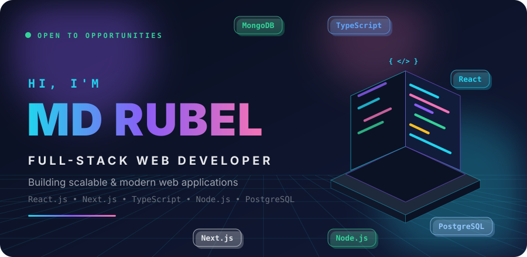
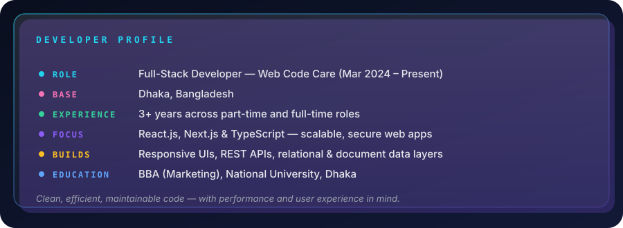
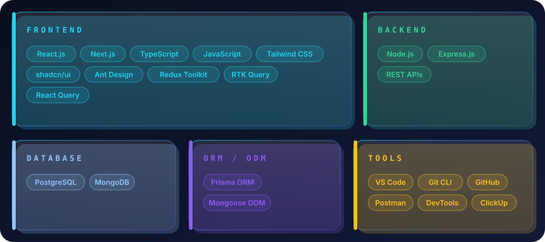
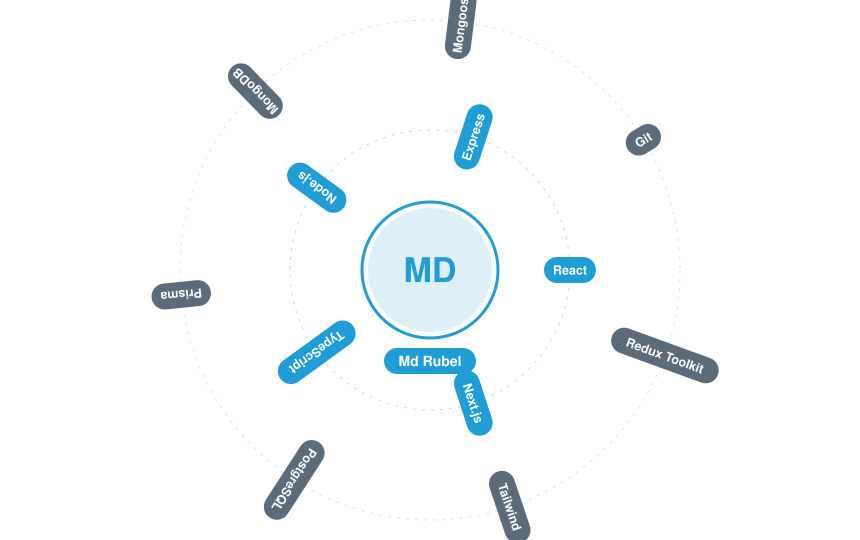
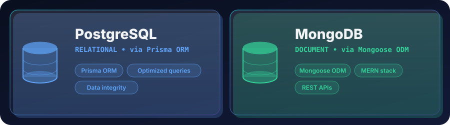
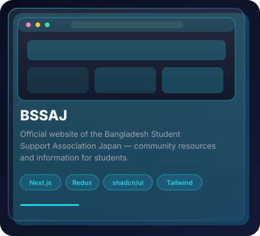
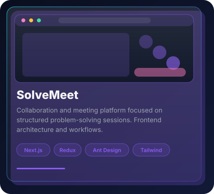
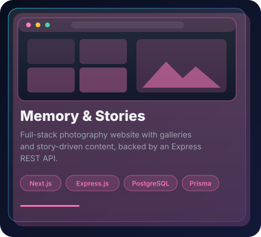
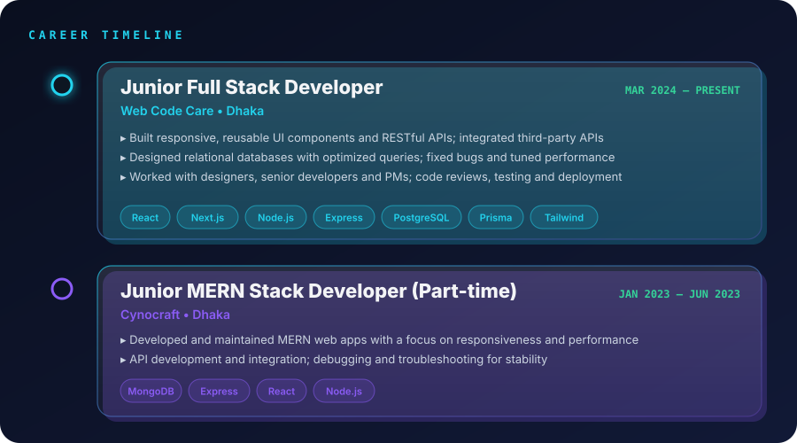
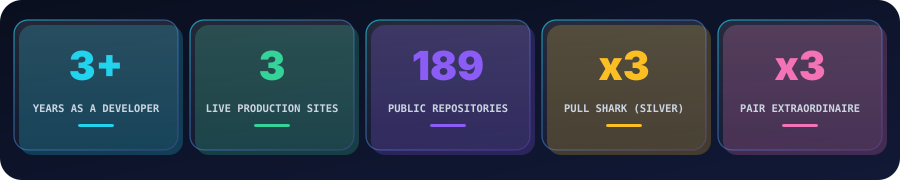

 

  

 

 

 

 

Live cards — they read directly from GitHub each time this page loads.

 

 

 

<table>
  <tr>
    <td align="center" width="33%">
       
      
    </td>
    <td align="center" width="33%">
       
      
    </td>
    <td align="center" width="33%">
       
      
    </td>
  </tr>
</table>

 

 

 

 

 

